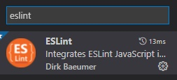
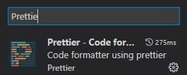

# <h1 style="color:blue;">Eslint & Prettierrc & Husky para React</h1>


Eslint y Prettierrc es uno de esos environments que son hoy en día casi obligatorios para trabajar con React. Esto es un resumen de la configuración que muchos usan de Eslint y Prettierrc.

Si lo que quieres es ver el 1,2,3... de como hacerlo desde 0 y entender mejor, te dejo un link de uno de los mejores videos que he visto para esto:

Eslint & Prettierrc - https://www.youtube.com/watch?v=EEDRcolSHms&t

## <p style="color:blue;">1- Instalar los paquetes siguientes:</p>

```css
yarn add eslint eslint-config-airbnb eslint-config-prettier eslint-plugin-babel eslint-plugin-import eslint-plugin-jsx-a11y eslint-plugin-react eslint-plugin-react-hooks husky lint-staged prettier pretty-quick -D
ó
npm i eslint eslint-config-airbnb eslint-config-prettier eslint-plugin-babel eslint-plugin-import eslint-plugin-jsx-a11y eslint-plugin-react eslint-plugin-react-hooks husky lint-staged prettier pretty-quick -D
```

## <p style="color:blue;">2- Configurando Eslint</p>

DOCUMENTOCION OFICIAL => https://eslint.org/docs/user-guide/configuring/

Creamos un archivo de .eslintrc.json o si ya lo tenemos sustituimos por esta configuración:

```json
{
  "parser": "babel-eslint",
  "parserOptions": {
    "sourceType": "module",
    "allowImportExportEverywhere": false,
    "codeFrame": false
  },
  "extends": ["airbnb", "plugin:prettier/recommended"],
  "plugins": [
    "babel",
    "react",
    "jsx-a11y",
    "import",
    "react-hooks",
    "prettier"
  ],
  "env": {
    "es6": true,
    "node": true,
    "browser": true
  },
  "rules": {
    "max-len": ["error", { "code": 100 }],
    "prefer-promise-reject-errors": ["off"],
    "react/jsx-filename-extension": ["off"],
    "react/prop-types": ["warn"],
    "no-return-assign": ["off"],
    "prettier/prettier": "error",
    "react-hooks/rules-of-hooks": "error",
    "react-hooks/exhaustive-deps": "error",
    "react/require-default-props": ["warn"],
    "react/jsx-indent": ["error", 4],
    "react/jsx-indent-props": ["error", 4],
    "react/jsx-first-prop-new-line": "off",
    "react/jsx-closing-bracket-location": "off",
    "react/forbid-prop-types": "off",
    "no-mixed-operators": "off",
    "react/jsx-props-no-spreading": "off",
    "arrow-parens": "off",
    "linebreak-style": 0,
    "id-length": [
      2,
      {
        "min": 3,
        "exceptions": [
          "id",
          "e",
          "p",
          "li",
          "td",
          "th",
          "Ul",
          "to",
          "as",
          "xs",
          "sm",
          "i"
        ]
      }
    ],
    "react/default-props-match-prop-types": [
      "error",
      { "allowRequiredDefaults": true }
    ],
    "import/no-cycle": "off",
    "no-use-before-define": ["off"]
  }
}
```

!!! Debes tener instalado igualmente el plugin de eslint en el VSC.



<p style="color:red;">OJO - NO INSTALE OTROS, HAY MUCHOS QUE NO FUNCIONAN. SOLO EL ORIGINAL PORFA!!! .</p>

## <p style="color:blue;">3- Configurando Prittier</p>

DOCUMENTOCION OFICIAL => https://prettier.io/docs/en/options.html

Creamos un archivo de .prettierrc o copiamos esta configuración:

```json
{
  "printWidth": 100,
  "tabWidth": 4,
  "singleQuote": true,
  "trailingComma": "all"
}
```

Debes tener instalado igualmente el plugin de Prettierrc en el VSC.



<p style="color:red;">OJO - NO INSTALE OTROS, HAY MUCHOS QUE NO FUNCIONAN. SOLO EL ORIGINAL PORFA!!! .</p>

## <p style="color:blue;">4- Configurando el husky y lint-staged en el package.json</p>

DOCUMENTOCION OFICIAL => https://typicode.github.io/husky/#/

<p style="color:teal;">1- Primero ejecutamos este comando que adicionará lo necesario para la configuración de husky con lint-staged:</p>

```
npx husky-init && npm install       # npm
npx husky-init && yarn              # Yarn 1
yarn dlx husky-init --yarn2 && yarn # Yarn 2

```

Esto nos crea por defecto una carpeta .husky donde tendremos nuestros hooks y una script en el package.json:

```json
// package.json
{
  "scripts": {
    "prepare": "husky install"
  }
}
```

<p style="color:teal;">2- Vamos la carpeta de .husky y dentro están los hooks que contienen nuestros comandos, por defecto el nos crea el pre-commit, donde se va a ejecutar el comando que tengamos antes del commit a git.</p>

En nuestro caso vamos a usar para el pre-commit el lint-staged que nos permite ejecutar varios comandos.

Por defecto el viene con `npm test` y lo vamos a sustituir por `npx lint-staged`

<p style="color:teal;">3- Vamos a configurar el lint-staged. Seria algo así al final del package.json:</p>

```json
"lint-staged": {
    "src/**/*.{js,jsx}": [
        "eslint",
        "pretty-quick --staged",
        "git add"
    ]
}
```

<p style="color:teal;">4- Creamos otro hook con el siguiente comando:</p>

```
npx husky add .husky/pre-push "npm test"
```

Este hook nos ayudará a correr los test antes de que hagamos un push al server. Así verificamos que no hemos roto nada. Vamos dentro de .husky/pre-push y sustituimos `npm test` por `npx jest`.

<p style="color:teal;">5- EJEMPLO DEL FLUJO:</p>
EJEMPLO DEL FLUJO (`pre-commit`):

```json
1-EJECUTAMOS -> git add .

2-EJECUTAMOS -> git commit -m "example"
 (Luego del Enter)

3-SE EJECUTA -> eslint - (Ejecuta eslint en los archivos que están en el staging area)

4-SE EJECUTA -> pretty-quick --staged -> (Formatea los archivos del commit evitando que por casualidad nos alvidamos de formatear algo.)

5-SE EJECUTA -> git add -> (Add lo que fue corregido al staging area)

 (Si no hay errores)
6-SE EJECUTA -> git commit -m "example"
```

EJEMPLO DEL FLUJO (`pre-push`):

```json
1-EJECUTAMOS -> git push

2-SE EJECUTA -> npx jest -> (Corre los unit test para evitar que exista código roto que se envie a git)

(Si no hay errores)
3-SE EJECUTA -> git push
```

## <p style="color:blue;">5- Creamos scripts(_OPCIONAL_)</p>

Con estos scripts podemos ejecutar tanto prettierrc como eslint en todo nuestro proyecto si fuera necesario.

```json
"prettier": "npx prettier . --write",
"eslint": "npx eslint . --fix",

```

## <p style="color:blue;">6- .ignore de prettierrc y eslint</p>

Para evitar problemas de que eslint o prettierrc se metan en carpetas que no les corresponde agregamos estos archivos:

.eslintignore

```

node_modules
.next
yarn.lock
package-lock.json
public
coverage
build

```

.prettierignore

```

node_modules
.next
yarn.lock
package-lock.json
public
coverage
build

```

## <p style="color:blue;">7- .editorconfig</p>

Con este archivo vamos a compartir alguna configuración necesaria para VSC y que todos los desarrolladores del equipo mantengan un standart predefinido. Creamos el archivo .editorconfig y añadimos esta configuración:

```json
root = true

[*]
indent_style = space
indent_size = 2
end_of_line = lf
charset = utf-8
trim_trailing_whitespace = true
insert_final_newline = true

[*.{js,jsx}]
editor.defaultFormatter = "esbenp.prettier-vscode",
editor.formatOnSave = true,

[{package.json,*.yml}]
indent_style = space
indent_size = 2

[*.md]
trim_trailing_whitespace = false

```
